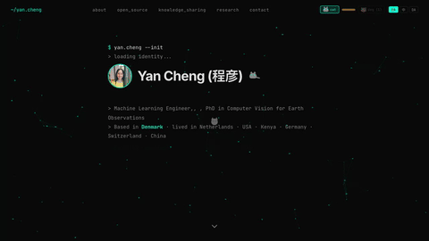

<div align="center">

<a href="https://yancheng-go.github.io">
  
</a>

# Yan Cheng

**Machine Learning Engineer | PhD in Computer Vision for Earth Observations**

Denmark · Previously: Netherlands, USA, Kenya, Germany, Switzerland, China

[](https://yancheng-go.github.io)
[](https://www.linkedin.com/in/yan-cheng-rs/)
[](https://scholar.google.com/citations?user=O6azk1oAAAAJ&hl=en)

</div>

---

### Research Impact

<!-- SCHOLAR-STATS:START -->
| Publications | Citations | h-index |
|:---:|:---:|:---:|
| 19 | 323 | 5 |
<!-- SCHOLAR-STATS:END -->

### Tech Stack

```text
AI & ML        PyTorch · Scikit-learn · Hugging Face · Computer Vision
Languages      Python · JavaScript · SQL · Bash
Geospatial     GDAL · Rasterio · GeoPandas · Google Earth Engine
Cloud & DevOps Azure · AWS · Docker · Git · CI/CD
Data           PostgreSQL/PostGIS · Pandas · Airflow
```

### GitHub Stats

<div align="center">


</div>

### Featured Projects

<!-- PINNED-REPOS:START -->
| Project | Description | Stars |
|---------|-------------|:-----:|
| [my-focal-ai](https://github.com/YanCheng-go/my-focal-ai) | Personal news intelligence — aggregate AI content from curat... | 4 |
| [danskprep](https://github.com/YanCheng-go/danskprep) | An app for Danish exam preparation. | 2 |
| [pixel-art-studio](https://github.com/YanCheng-go/pixel-art-studio) | Browser-based pixel art editor with AI generation (Gemini) a... | 1 |
| [Cross-Resolution-Dead-Tree-Segmentation](https://github.com/YanCheng-go/Cross-Resolution-Dead-Tree-Segmentation) | Cross-resolution segmentation of individual dead trees from ... | 1 |
| [YanCheng-go](https://github.com/YanCheng-go/YanCheng-go) | GitHub profile README — auto-synced from yancheng-go.github.... | - |
| [litmus-test-yan](https://github.com/YanCheng-go/litmus-test-yan) | A simple deforestation detector using Landsat timeseries | - |
<!-- PINNED-REPOS:END -->

---

<div align="center">
<sub>Auto-updated via GitHub Actions · <!-- LAST-UPDATED:START -->2026-03-30<!-- LAST-UPDATED:END --></sub>
</div>
